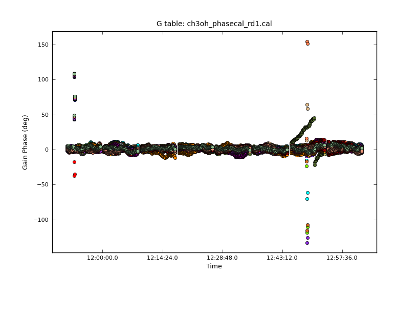
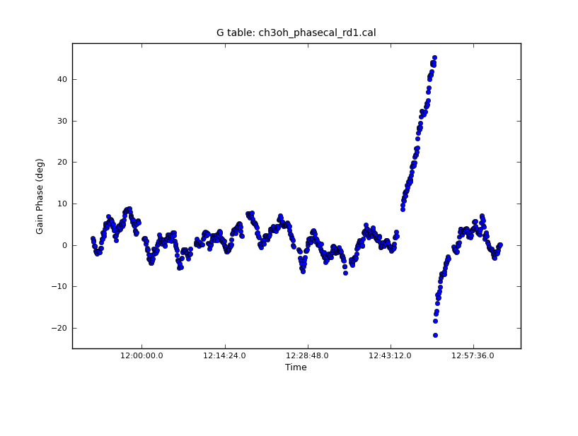
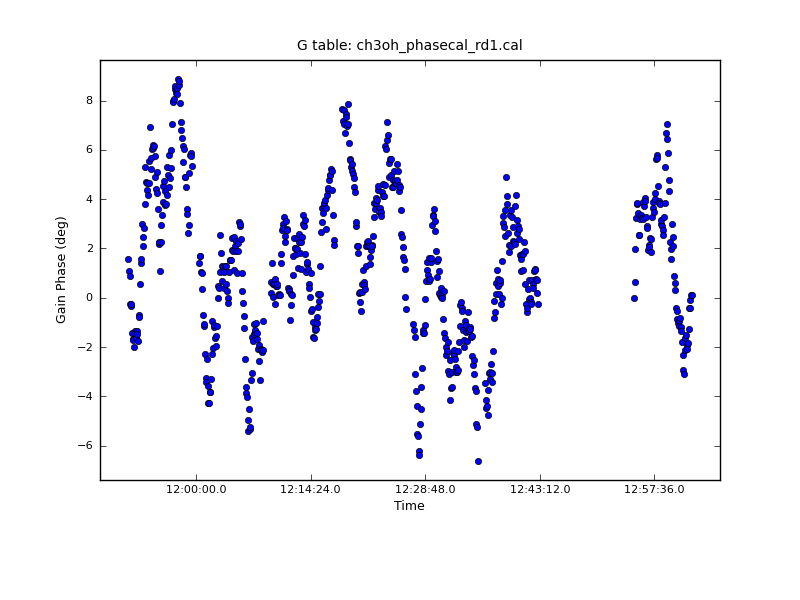
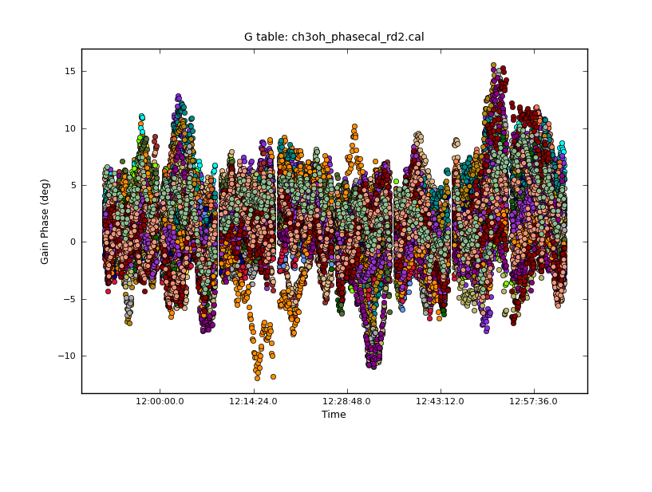

W51 CH3OH Maser Self-Cal
========================

.. code-block:: python

    imsize=1024
    split(spw='7:580~600', vis='13A-064.sb21341436.eb23334759.56447.48227415509.ms', outputvis='ch3oh_maser.ms', field='W51 Ku')
    clean(vis='ch3oh_maser.ms', imsize=imsize, imagename='ch3oh_maser_rd1.image')
    """
    (ch3oh_maser_rd1.image)
            Stokes       Velocity          Frame        Doppler      Frequency
                 I   -33.9408km/s           LSRK          RADIO    6.66798e+09
    BrightnessUnit       BeamArea           Npts            Sum    FluxDensity
           Jy/beam        18.4952          33033  -9.758288e+02  -5.276112e+01
              Mean            Rms        Std dev        Minimum        Maximum
     -2.954103e-02   1.230303e-01   1.194329e-01  -7.456788e-01   7.790660e-01
      region count
                 1
    """
    vis = 'ch3oh_maser.ms'
    solint = '3s'
    caltable1 = 'ch3oh_phasecal_rd1.cal'
    gaincal(vis=vis,
               field='',
               caltable=caltable1,
               spw='',
               gaintype='G', 
               solint=solint,
               refant='',
               calmode='p')
    """
     Insufficient unflagged antennas to proceed with this solve.
       (time=2013/06/04/11:51:22.5 field=0 spw=0 chan=0)
     Insufficient unflagged antennas to proceed with this solve.
       (time=2013/06/04/12:18:17.5 field=0 spw=0 chan=0)
    """

    plotcal(caltable=caltable1, yaxis='phase')
    # INFO2 Number of points being plotted : 38542

   
There is clearly something wrong at a few times; I hand-flagged those.  The dark green
antenna that is wrapping is

::

   2013-08-20 19:01:46 INFO  	2013/06/04/12:50:47.5  Antenna='ea23' SpwId=0 Field='W51 Ku' pol,chan=[0,0] 

.. code-block:: python

   plotcal(caltable=caltable1, yaxis='phase', antenna='ea23', poln='R', figfile='plots/ch3oh_maser_phasecal_rd1_ea23R.png')
   # flagged from 12:43:45~12:54:40
   plotcal(caltable=caltable1, yaxis='phase', antenna='ea23', poln='R', figfile='plots/ch3oh_maser_phasecal_rd1_ea23R_flagged.png')

           
   Before flagging, ea23

   After flagging, ea23

.. code-block:: python

    applycal(vis=vis,
        gaintable=caltable1,
        interp='linear',
        flagbackup=True)

    clean(vis='ch3oh_maser.ms', imsize=imsize, imagename='ch3oh_maser_rd2')
    """
    (ch3oh_maser_rd2.image)
            Stokes       Velocity          Frame        Doppler      Frequency
                 I   -33.9408km/s           LSRK          RADIO    6.66798e+09
    BrightnessUnit       BeamArea           Npts            Sum    FluxDensity
           Jy/beam        18.7481          26883  -8.861679e+02  -4.726703e+01
              Mean            Rms        Std dev        Minimum        Maximum
     -3.296388e-02   1.104338e-01   1.054012e-01  -4.735539e-01   7.208058e-01
      region count
                 1
    """    

    # statsbox was made for imsize 512...
    statsbox='170,50,229,97'
    statsbox=",".join([str(int(x)*(imsize/512)) for x in statsbox.split(",")])
    imstat('ch3oh_maser_rd1.image',box=statsbox)['rms']
    # 0.12654169
    imstat('ch3oh_maser_rd2.image',box=statsbox)['rms']
    # 0.10412835

20% improvement.  Let's try another round.

.. code-block:: python

    caltable2 = 'ch3oh_phasecal_rd2.cal'
    gaincal(vis=vis,
            field='',
            caltable=caltable2,
            spw='',
            gaintype='G', 
            solint=solint,
            refant='',
            calmode='p')
    """
    Insufficient unflagged antennas to proceed with this solve.
     (time=2013/06/04/11:51:22.5 field=0 spw=0 chan=0)
    Insufficient unflagged antennas to proceed with this solve.
     (time=2013/06/04/12:18:17.5 field=0 spw=0 chan=0)
    """
    plotcal(caltable=caltable2, yaxis='phase', figfile='plots/ch3oh_maser_phasecal_rd2.png')

   Round 2 of phase-only self-cal.  Looks good.

.. code-block:: python

    applycal(vis=vis,
        gaintable=caltable2,
        interp='linear',
        flagbackup=True)

    clean(vis='ch3oh_maser.ms', imsize=imsize, imagename='ch3oh_maser_rd3')
    imstat('ch3oh_maser_rd3.image',box=statsbox)['rms']
    # 0.10188296

Only a 2% improvement this time; probably done.

OK, now I'll try to move on to the amp + phase cal.

.. code-block:: python

    caltable_gp = 'ch3oh_ampphase.cal'
    gaincal(vis=vis,
            field='',
            caltable=caltable_gp,
            gaintable=caltable2,
            spw='',
            gaintype='G', 
            solint='30s',
            refant='',
            calmode='ap')
    plotcal(caltable=caltable_gp, yaxis='phase', figfile='plots/ch3oh_maser_ampphasecal_phase.png')
    plotcal(caltable=caltable_gp, yaxis='amp', figfile='plots/ch3oh_maser_ampphasecal_amp.png')

.. figure:: plots/ch3oh_maser_ampphasecal_phase.png
   :width: 800px

   Miniscule phase changes; that's good.

.. figure:: plots/ch3oh_maser_ampphasecal_amp.png
   :width: 800px
   
   Whopping amplitude changes for some antennae, but contiguous.  Is this ok?           

.. code-block:: python

    applycal(vis=vis,
             gaintable=[caltable2,caltable_gp],
             interp='linear',
             flagbackup=True)
    clean(vis='ch3oh_maser.ms', imsize=imsize, imagename='ch3oh_maser_ampphase')
    imstat('ch3oh_maser_ampphase.image',box=statsbox)['rms']
    # 0.08872171
    viewer(infile='ch3oh_maser_ampphase')

    peakbox = '217,247,228,258'
    peakbox = ",".join([str(int(x)*(imsize/512)) for x in peakbox.split(",")])
    peaks = [imstat(img,box=peakbox)['max']
             for img in ('ch3oh_maser_rd1.image','ch3oh_maser_rd2.image','ch3oh_maser_rd3.image','ch3oh_maser_ampphase.image')]
    # [ 87.956imsize45,  88.58364105,  88.65736389,  87.88169861]

So with the final cal, there is again significant RMS improvement, but no real change in the peak.

Now for a deep clean in the cube...

.. code-block:: python

    imagename = 'ch3oh_6ghz_maser_speccube_selfcal'
    clean(vis=vis, imagename=imagename, field='W51 Ku', mode='velocity', 
          weighting='briggs', robust=-2, niter=10000, spw='0',
          restfreq='6.6685192GHz', multiscale=[0,5,15,100,200],
          imsize=imsize, cell='0.5 arcsec')
    exportfits(imagename=imagename+".image", fitsimage=imagename+".fits", overwrite=True)

Do the same over the *whole* spectral cube:

.. code-block:: python

    vis = '13A-064.sb21341436.eb23334759.56447.48227415509.ms'
    vis2 = 'ch3oh_spw7_full.ms'
    split(vis=vis,outputvis=vis2,spw='7',field='W51 Ku')
    applycal(vis=vis2,
             gaintable=[caltable2,caltable_gp],
             interp='linear',
             flagbackup=True)
    imagename = 'ch3oh_6ghz_maser_speccube_masercal'
    clean(vis=vis2,imagename=imagename,field='W51 Ku', mode='velocity', 
            weighting='briggs', robust=-2, niter=10000, spw='',
            restfreq='6.6685192GHz')
    exportfits(imagename=imagename+".image", fitsimage=imagename+".fits", overwrite=True)

Now try applying those to the continuum

.. code-block:: python

   vis = 'W51Ku_spw8_split.ms'
   applycal(vis=vis,
            gaintable=[caltable2,caltable_gp],
            interp='linear',
            flagbackup=True)
   imagename = 'spw8_continuum_selfcal_by_maser'
   clean(vis=vis, imagename=imagename, field='W51 Ku', mode='mfs', 
         weighting='briggs', robust=0, niter=10000, spw='0',
         multiscale=[0,5,15,100,200],
         imsize=imsize, cell='0.5 arcsec')

   irs2box="551,560,573,587"
   statsbox
   imstat(img,box=irs2box)
   imstat(img,box=statsbox)

This looks great.  Using irs2 for the peak:
'max': 1.37456334
'rms': 0.00913563

ALL the continuum now!!  We'll see if it works; started 9:30pm August 20 and
probably won't finish for a day

.. code-block:: python

   # exclude 6 because it has the maser within 
   vis = 'continuum_spws.ms'
   split(vis='13A-064.sb21341436.eb23334759.56447.48227415509.ms', outputvis=vis,
         width=8, spw='0,1,2,3,4,5,8,9,10,12,14,16,18,20,21')
   applycal(vis=vis,
            gaintable=[caltable2,caltable_gp],
            interp='linear',
            flagbackup=True)
   imagename = 'allspw_continuum_selfcal_by_maser'
   clean(vis=vis, imagename=imagename, field='W51 Ku', mode='mfs', 
         weighting='briggs', robust=0, niter=10000, spw='',
         multiscale=[0,5,15,100,200],
         imsize=imsize, cell='0.5 arcsec')

Hmm, this did *not* work, I got these errors:

::

    The following MS spws have no corresponding cal spws: 1 2 3 4 5 6 7 8 9 10 11 12 13 14
    The following MS spws have no corresponding cal spws: 1 2 3 4 5 6 7 8 9 10 11 12 13 14
    2013-08-21 03:44:53     WARN    applycal::Calibrater::correct   Spectral window(s) 1, 2, 3, 4, 5, 6, 7, 8, 9, 10, 11, 12, 13, 14,
    2013-08-21 03:44:53     WARN    applycal::Calibrater::correct+    could not be corrected due to missing (pre-)calibration
    2013-08-21 03:44:53     WARN    applycal::Calibrater::correct+      in one or more of the specified tables.
    2013-08-21 03:44:53     WARN    applycal::Calibrater::correct+      Please check your results carefully!

So do I have to trick applycal to work on these?

..  

  Miller's notes:
  Each time you run phase-only self-cal, using a short short solint:
      + look at phases with plotcal
      + make sure same IF is doing same thing for each antenna
      + make sure not noisy & ratty: would indicat too short a solint

  Use phase-corrected data for calib with long solint (5-15min) to solve for amp & phase
      + Differential self-cal: use the *last* cal table.  With phase self-cal, use the original each time, with amp & phase,
      + look at data with plotcal.  Phases should be close to zero because you've done a differential self-cal
      + make new image after running last self-cal on amplitude...  S/N should always be increasing

  original caltable: non-self-cal, use every time

