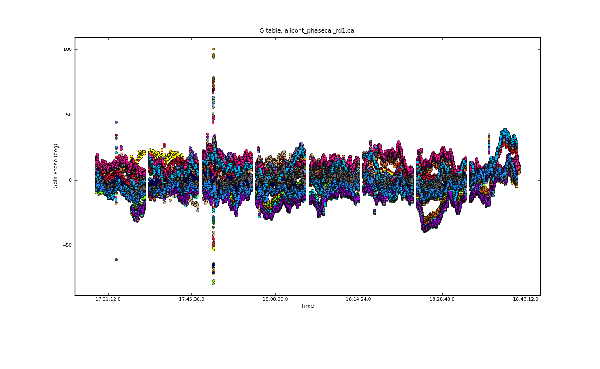
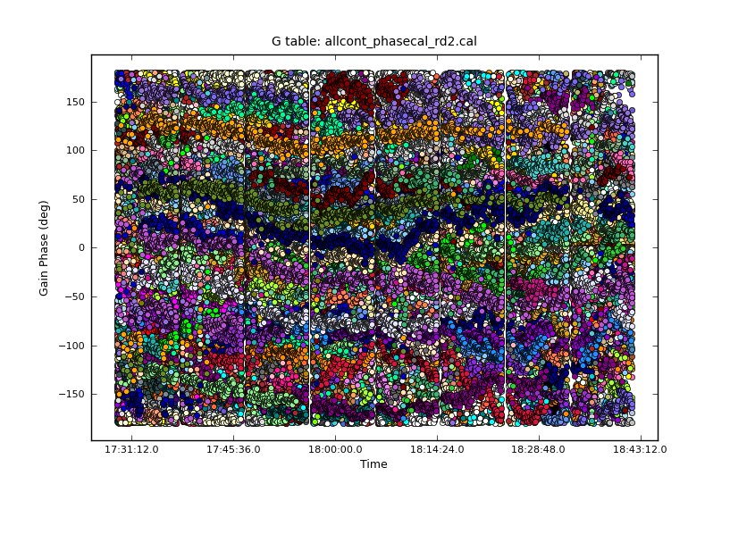

W51 Ku-band calibration
=======================

Re-doing the calibration completely from scratch since the pipeline appears to
have failed on spw0, which includes the (potential) 12.1 GHz masers.

Based on this excessively complicated example:
http://casaguides.nrao.edu/index.php?title=EVLA_6cmWideband_Tutorial_SN2010FZ_CASA_4.1

.. code-block:: python

     rawvis='13A-064.sb18020284.eb19181492.56353.71736577546.ms'
     vis = '3c48_Ku_test.ms'
     calibrator = '0137+331=3C48'
     split(vis=rawvis, outputvis=vis, field=calibrator, datacolumn='data', spw='0', width=8, timebin='10s')

.. code-block:: python

     rawvis='13A-064.sb18020284.eb19181492.56353.71736577546.ms'
     vis = '3c48_Ku.ms'
     calibrator = '0137+331=3C48'
     split(vis=rawvis, outputvis=vis, field=calibrator, datacolumn='data', spw='')
     setjy(vis=vis, field=calibrator, scalebychan=True, modimage='3C48_C.im', usescratch=False)
     gencal(vis=vis,caltable='calKu.antpos',caltype='antpos',antenna='')
     gencal(vis=vis,caltable='calKu.gaincurve',caltype='gc')
     gaincal(vis=vis,caltable='calKu.G0',field=calibrator, spw='',
        gaintable=['calKu.antpos','calKu.gaincurve'],
        gaintype='G',refant='', calmode='p',solint='int',minsnr=3,gaincurve=False)
     plotcal(caltable='calKu.G0',xaxis='time',yaxis='phase', figfile='plots/3c48_phasecal_phase.png')
     gaincal(vis=vis,caltable='calKu.K0',
        gaintable=['calKu.antpos','calKu.gaincurve','calKu.G0'],
        field=calibrator,spw='',gaintype='K',gaincurve=False,
        refant='',combine='scan',solint='inf',minsnr=3)
     plotcal(caltable='calKu.G0',xaxis='time',yaxis='phase', figfile='plots/3c48_ampcal_phase.png')
     plotcal(caltable='calKu.G0',xaxis='time',yaxis='amp', figfile='plots/3c48_ampcal_amp.png')
     bandpass(vis=vis,caltable='calKu.B0',
         gaintable=['calKu.antpos','calKu.gaincurve', 'calKu.G0','calKu.K0'],
         field=calibrator,refant='',solnorm=False,
         bandtype='B', combine='scan', solint='inf', gaincurve=False)
     plotcal(caltable='calKu.B0',xaxis='freq',yaxis='amp', figfile='plots/3c48_bandcal_amp.png')
     plotcal(caltable='calKu.B0',xaxis='freq',yaxis='phase', figfile='plots/3c48_bandcal_phase.png')
     gaincal(vis=vis,caltable='calKu.G1int',
        gaintable=['calKu.antpos','calKu.gaincurve',
                   'calKu.K0','calKu.B0'],
        field='2',refant='',solnorm=F,
        spw='', solint='int',gaintype='G',calmode='p',gaincurve=False,)
     plotcal(caltable='calKu.G1int',xaxis='time',yaxis='phase', figfile='plots/3c48_finalcal_phase.png')
     plotcal(caltable='calKu.G1int',xaxis='time',yaxis='amp', figfile='plots/3c48_finalcal_amp.png')
     clean(vis=vis, imagename='3c48_Ku', imsize=1024)

A refant is required, so I tried ea04.  Got this error:
The following MS spws have no corresponding cal spws: 0 10

W51 Ku-band Continuum Self-Cal
==============================

Like with C-band, this represents an attempt to accurately self-cal the data. 
The biggest changes here from the old attempt are:

 1. Use ALL continuum together
 2. Use a larger imsize for the models

.. code-block:: python

   split(vis='13A-064.sb18020284.eb19181492.56353.71736577546.ms',spw='0,2~8,10,12~14,16~18,20', datacolumn='data',
         outputvis='W51_Ku_continuum_bands_try2.ms')
   imsize=1024
   clean(vis='W51Ku_continuum_band_try2s.ms', imsize=imsize, imagename='ku_continuum_rd1')
   caltable1 = 'allcont_phasecal_rd1.cal'
   gaincal(vis=vis,field='',caltable=caltable1,spw='',gaintype='G',solint='3s',refant='',calmode='p')

Got a lot of these messages::

    2 of 46 solutions flagged due to SNR < 3 in spw=3 at 2013/03/02/17:49:10.5

.. code-block:: python

    imsize=1024
    rd1 = 'ku_continuum_rd1'
    statsbox='440,314,550,430'
    rms = imstat(rd1+".image",box=statsbox)['rms']
    peakbox = '528,535,547,552'
    peak = imstat(rd1+".image",box=peakbox)['max']
    print "S/N: ",peak/rms," N: ",rms
    # S/N:  [ 59.64445149]  N:  [ 0.04121845]

.. code-block:: python

   plotcal(caltable=caltable1, yaxis='phase', figfile='plots/ku_continuum_phasecal_rd1.png')

There are some bad antennae at some times.

.. code-block:: python

    plotcal(caltable=caltable1, yaxis='phase', figfile='plots/ku_continuum_phasecal_rd1_badants.png',antenna='ea21,ea20,ea24,ea19,ea22',spw='0,1,2,7,8,9,10')
    plotcal(caltable=caltable1, yaxis='phase', figfile='plots/ku_continuum_phasecal_rd1_flagged.png')

    applycal(vis=vis, gaintable=caltable1, interp='linear', flagbackup=True)
    rd2 = 'ku_continuum_rd2'
    clean(vis='W51Ku_continuum_bands.ms', imsize=imsize, imagename=rd2)

    rms = imstat(rd2+".image",box=statsbox)['rms']
    peak = imstat(rd2+".image",box=peakbox)['max']
    print "S/N: ",peak/rms," N: ",rms
    # S/N:  [ 53.53753382]  N:  [ 0.06048758]

Not a good sign.

.. code-block:: python

    caltable2 = 'allcont_phasecal_rd2.cal'
    gaincal(vis=vis, field='',caltable=caltable2,spw='',gaintype='G',solint='3s',refant='',calmode='p')
    plotcal(caltable=caltable2, yaxis='phase', figfile='plots/ku_continuum_phasecal_rd2.png')

.. image:: plots/ku_continuum_phasecal_rd1.png

.. image:: plots/ku_continuum_phasecal_rd1_flagged.png 

